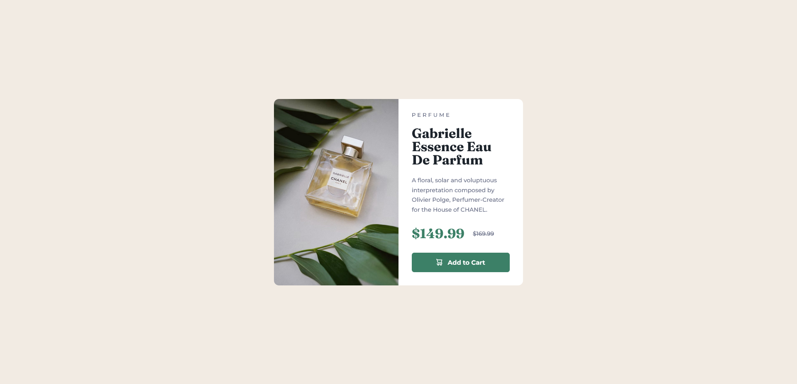
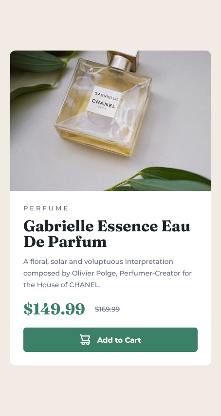

# Frontend Mentor - Product Preview Card Component Solution

This is a solution to the [Product preview card component challenge on Frontend Mentor](https://www.frontendmentor.io/challenges/product-preview-card-component-GO7UmttRfa).

## Table of contents

- [Overview](#overview)
  - [The challenge](#the-challenge)
  - [Screenshot](#screenshot)
  - [Links](#links)
- [My process](#my-process)
  - [Built with](#built-with)
  - [What I learned](#what-i-learned)
  - [Continued development](#continued-development)
- [Author](#author)

## Overview

### The challenge

Users should be able to:

- View the optimal layout depending on their device's screen size.
- See hover and focus states for interactive elements.

### Screenshot




### Links

- Solution URL: [GitHub](https://your-solution-url.com)
- Live Site URL: [GitHub Pages](https://your-live-site-url.com)

## My process

### Built with

- Semantic HTML5 markup
- CSS custom properties
- Flexbox

### What I learned

This was my first time developing from mobile first. I really enjoyed this project. Having two seperate images for the different versions was interesting. I managed to get it right relatively easily using this HTML and CSS code:

```html


```
```css
.hero-mobile {
    border-top-left-radius: 0.75rem;
    border-top-right-radius: 0.75rem;
}

.hero-desktop {
    border-top-left-radius: 0.75rem;
    border-bottom-left-radius: 0.75rem;
    display: none;
}
```
And then to display the desktop picture when the size was right:
```css
    .hero-mobile {
        display: none;
    }

    .hero-desktop {
        display: block;
    }
```

### Continued development

I feel like I'm ready to take on more complex challenges and I'll keep focusing on developing for mobile first.

## Author

- Frontend Mentor - [@wesleyjacoby](https://www.frontendmentor.io/profile/wesleyjacoby)